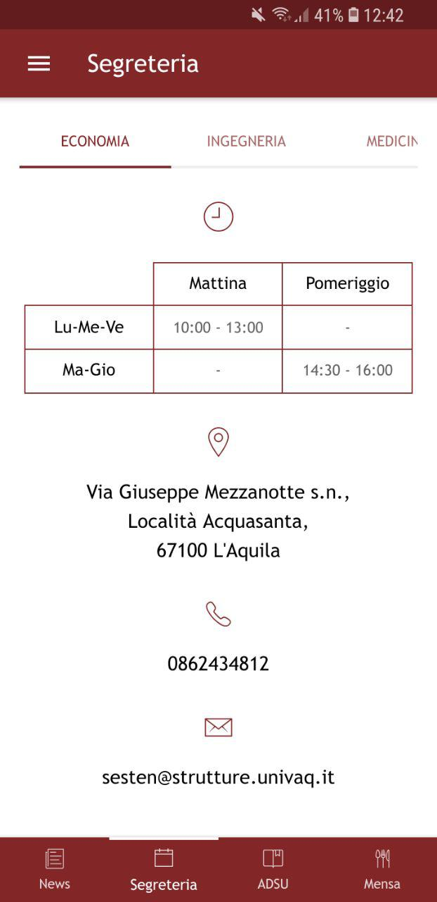

# UnivaqPush
Unofficial Hybrid mobile app of University of L'Aquila.<br /><br />

## Getting Started
### Prerequisites
Install the latest version of the CLI and Cordova

```
npm install -g ionic cordova
```
### Installing
Open AndroidNative folder and follow the instructions inside the README to
make the app correctly work.

You also need to set these environments variables inside Ionic project for a 
complete setup:

<b>APP_ID</b> (Google App ID)<br />
<b>GOOGLE_PROJECT_NUMBER</b><br />
<b>GOOGLE_API_KEY</b><br />
<b>NEWS_ON</b> (String that indicates that news are enabled)<br />
<b>NEWS_OFF</b> (String that indicates that news are enabled)<br />
<b>MAX_NEWS_NUMBER</b> (Max storable news number)<br />
<b>POST_MAX_LENGTH</b> (Max length of facebook posts, future implementation)<br />

## Deployment
Build project on android

```
ionic cordova build android
```

## Screenshots

<p align="center">
   
  
  
  
  
  
</p>

## License
This project is licensed under the MIT License - see the LICENSE.md file for details

## Authors

* **Martella Stefano**

## Info


* Website: https://univaqpush.it
* Mail : univaqpush@gmail.com
