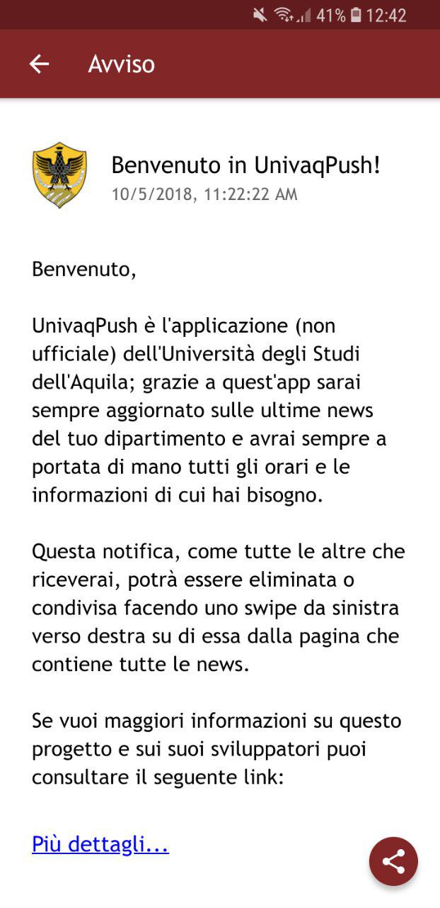
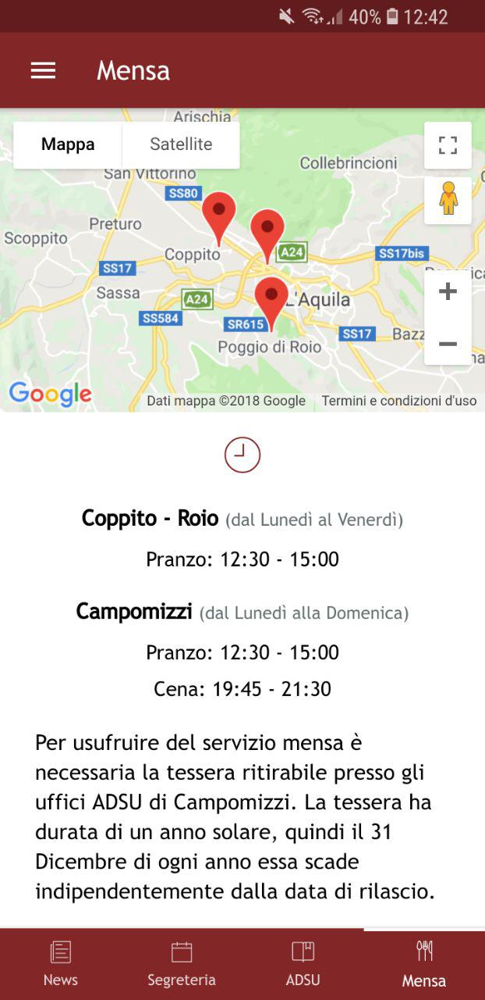

## UnivaqPush
Unofficial Hybrid mobile app of University of L'Aquila. 

## Note
Open AndroidNative folder and follow the instructions inside the README to
make the app correctly work.

You also need to set these environments variables inside Ionic project for a 
complete setup:

<b>APP_ID</b> (Google App ID) 
<b>GOOGLE_PROJECT_NUMBER</b> 
<b>GOOGLE_API_KEY</b> 
<b>BANNER_ID</b> (AdMob banner ID) 
<b>NEWS_ON</b> (String that indicates that news are enabled) 
<b>NEWS_OFF</b> (String that indicates that news are enabled) 
<b>MAX_NEWS_NUMBER</b> (Max news number storable) 
<b>POST_MAX_LENGTH</b> (Max length of facebook posts, future implementation) 

## Screenshots

   
  
  
  
  
  

