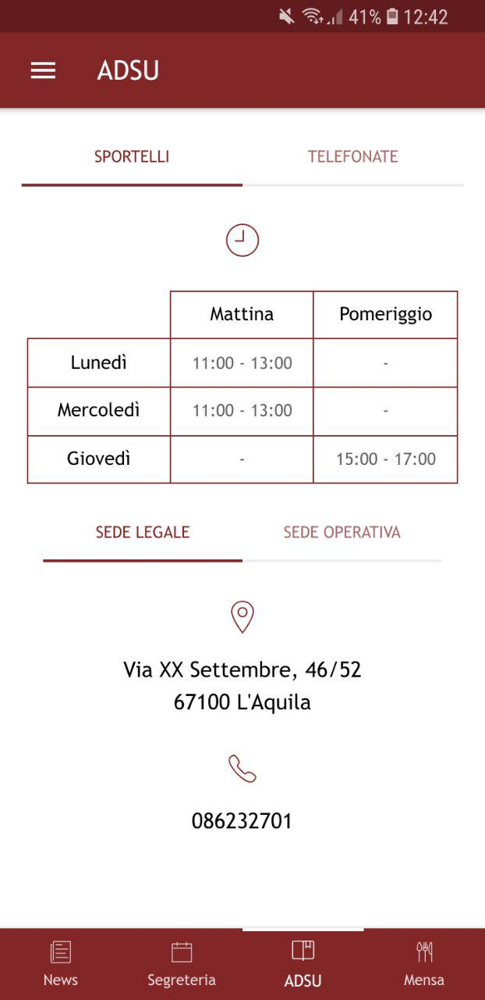

# UnivaqPush
Unofficial Hybrid mobile app of University of L'Aquila.<br /><br />
website:<br />
https://univaqpush.it<br /><br />
info:<br />
univaqpushinfo@gmail.com

### Getting started
Copy this project on locally with git clone or direct download.
This project requires Ionic 3 and Java >= 8 installed on your system.

### Prerequisites

After cloning this project on your pc move inside the project folder
and install all necessary plugins from the command line running: 

```
npm install --save
```

You also need to set these environments variables inside Ionic project for a complete setup:

```
export const ENV = {
  APP_ID: 'your_google_app_id',
  GOOGLE_PROJECT_NUMBER: 'your_google_project_number',
  GOOGLE_API_KEY: 'your_google_api_key',
  NEWS_ON: 'news_enabled',
  NEWS_OFF 'news_disabled',
  MAX_NEWS_NUMBER: 'max_news_number',
  POST_MAX_LENGTH: 'max_post_length'
}
```

For more datails on how to set environment variables in Ionic visit this [link](https://github.com/gshigeto/ionic-environment-variables).

Open AndroidNative folder and follow the instructions inside the [README.md](AndroidNative/README.md) to make the app correctly work with Android platform. 

<!-- ### Installing -->

## Screenshots

<p align="center">
   
  
  
  
  
  
</p>

<!--
  ## Running the tests
  ### Break down into end to end tests
  ### And coding style tests
-->
<!-- ## Deployment -->

## Built With
[Ionic framework](https://ionicframework.com/docs/)

<!-- 
  ## Contributing
  Please read [CONTRIBUTING.md](CONTRIBUTING.md) for details on our code of conduct, and the process for submitting pull requests to us.
-->
<!-- Versioning -->

## Authors
* [Stefano Martella](https://github.com/StefanoMartella) - Application and server side.
* [Lorenzo Andreoli](https://github.com/loreand95) - Website.

## License
This project is licensed under the MIT License - see the [LICENSE.md](LICENSE) file for details

<!-- 
  ## Acknowledgments
  * Hat tip to anyone whose code was used
  * Inspiration
  * etc
-->
